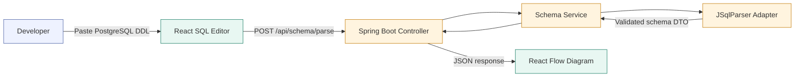
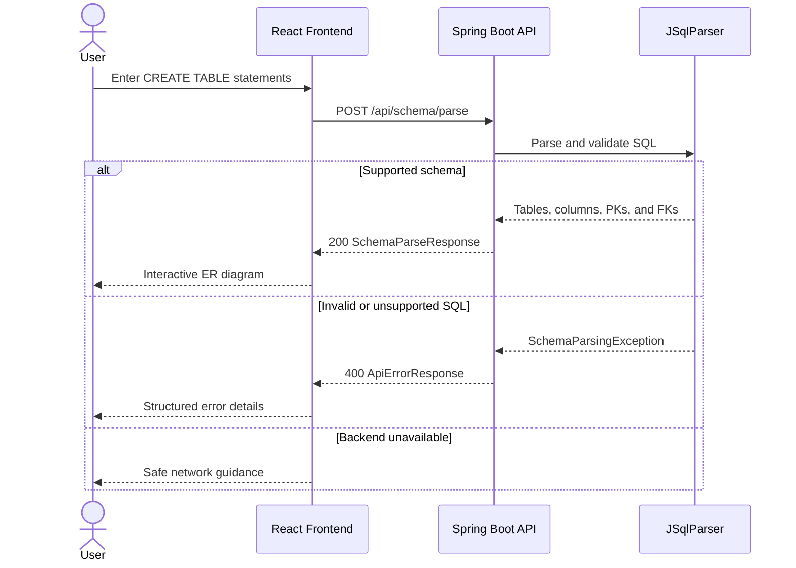
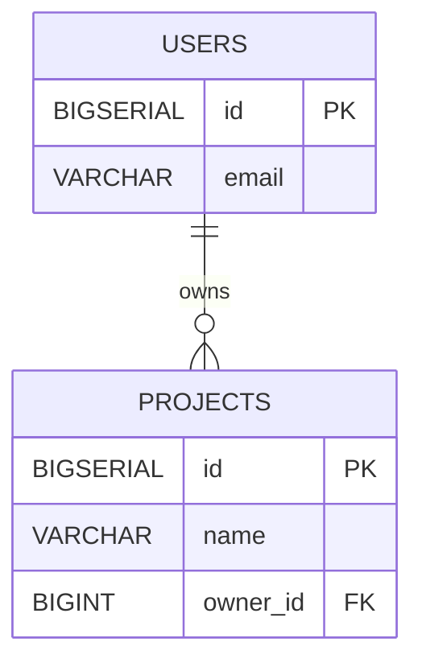
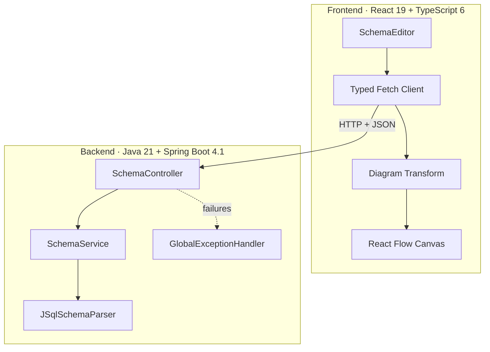
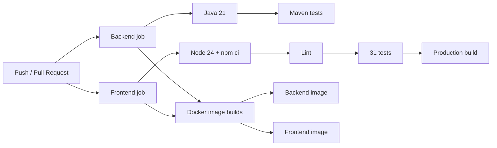

# QueryLens

*Turn PostgreSQL schemas into interactive ER diagrams.*

Paste `CREATE TABLE` statements, parse them with a Java backend, and explore
the resulting tables and relationships in a draggable React Flow canvas.

[](https://github.com/fatinaman/QueryLens/actions/workflows/ci.yml)


## What QueryLens does

QueryLens is a stateless schema-visualization tool for a practical subset of
PostgreSQL DDL. It extracts tables, columns, keys, types, and relationships,
then renders them as an interactive entity-relationship diagram.

- Parse multiple PostgreSQL `CREATE TABLE` statements.
- Preserve table and column declaration order.
- Identify primary and foreign keys, including named and composite constraints.
- Display data types and nullability.
- Render draggable table nodes and directional relationship edges.
- Zoom, pan, fit the diagram, and navigate with a minimap.
- Show useful validation, parser, response, and network errors.
- Preserve the last successful diagram when a later request fails.
- Operate without a database, authentication, or schema persistence.

## How it works



### Request lifecycle



## Example

Input:

```sql
CREATE TABLE users (
    id BIGSERIAL PRIMARY KEY,
    email VARCHAR(255) NOT NULL
);

CREATE TABLE projects (
    id BIGSERIAL PRIMARY KEY,
    name VARCHAR(150) NOT NULL,
    owner_id BIGINT NOT NULL REFERENCES users(id)
);
```

Relationship produced:



## Architecture



| Layer | Technology | Responsibility |
| --- | --- | --- |
| UI | React 19, TypeScript 6, plain CSS | SQL input, feedback, and page state |
| Diagram | React Flow 12 | Nodes, edges, controls, minimap, and interaction |
| API client | Fetch API | Typed requests, validation, cancellation |
| HTTP API | Spring Boot 4.1 | Validation, CORS, and request handling |
| Parser | JSqlParser 5.3 | PostgreSQL DDL syntax-tree parsing |
| Tests | JUnit, Vitest | Backend and frontend verification |
| Runtime | Docker Compose, nginx | Local production-style two-service runtime |
| CI | GitHub Actions | Tests, lint, builds, and container builds |

## Repository structure

```text
QueryLens/
|-- .github/
|   `-- workflows/
|       `-- ci.yml
|-- backend/
|   |-- .mvn/wrapper/
|   |-- src/
|   |   |-- main/java/com/querylens/backend/
|   |   |   |-- config/
|   |   |   |-- controller/
|   |   |   |-- dto/
|   |   |   |-- exception/
|   |   |   |-- parser/
|   |   |   `-- service/
|   |   `-- test/java/com/querylens/backend/
|   |-- Dockerfile
|   |-- pom.xml
|   `-- README.md
|-- docs/
|   |-- API.md
|   `-- PROJECT_STATE.md
|-- frontend/
|   |-- src/
|   |   |-- api/
|   |   |-- components/
|   |   |   |-- DiagramCanvas/
|   |   |   |-- SchemaEditor/
|   |   |   `-- TableNode/
|   |   |-- constants/
|   |   |-- test/
|   |   |-- types/
|   |   `-- utils/
|   |-- Dockerfile
|   |-- nginx.conf
|   |-- package.json
|   `-- README.md
|-- docker-compose.yml
`-- README.md
```

## Quick start

### Prerequisites

- Java Development Kit 21
- Node.js 24 LTS and npm 11
- Git

Docker with Compose v2 is optional.

### 1. Clone the repository

```bash
git clone https://github.com/fatinaman/QueryLens.git
cd QueryLens
```

### 2. Start the backend

PowerShell:

```powershell
Set-Location backend
.\mvnw.cmd spring-boot:run
```

macOS or Linux:

```bash
cd backend
./mvnw spring-boot:run
```

The API starts at `http://localhost:8080`.

### 3. Start the frontend

In another terminal:

```bash
cd frontend
npm ci
npm run dev
```

Open the URL printed by Vite, normally `http://localhost:5173`.

### 4. Create a diagram

1. Paste one or more supported `CREATE TABLE` statements.
2. Select **Generate Diagram** or press `Ctrl+Enter`.
3. Drag tables and use the zoom, fit-view, and minimap controls.
4. Select **Load Example** for the included three-table demonstration.

## API

```http
POST /api/schema/parse
Content-Type: application/json
```

Request:

```json
{
  "sql": "CREATE TABLE users (id BIGSERIAL PRIMARY KEY);"
}
```

Successful response:

```json
{
  "tables": [
    {
      "name": "users",
      "columns": [
        {
          "name": "id",
          "dataType": "BIGSERIAL",
          "nullable": false,
          "primaryKey": true
        }
      ],
      "foreignKeys": []
    }
  ]
}
```

See [docs/API.md](docs/API.md) for the complete contract, validation rules,
error responses, and supported SQL subset.

## Environment variables

| Variable | Component | Default | Description |
| --- | --- | --- | --- |
| `SERVER_PORT` | Backend | `8080` | Backend HTTP port |
| `ALLOWED_ORIGINS` | Backend | Vite origin | Allowed CORS origins |
| `VITE_API_BASE_URL` | Frontend | Local API | Backend base URL |

Copy `frontend/.env.example` to `frontend/.env` only when a local override is
needed. The exact defaults are `http://localhost:5173` for CORS and
`http://localhost:8080` for the API. QueryLens currently requires no secrets.

## Testing

### Backend

```powershell
Set-Location backend
.\mvnw.cmd clean test
```

```text
Tests run: 47, Failures: 0, Errors: 0, Skipped: 0
```

### Frontend

```bash
cd frontend
npm ci
npm run lint
npm run test
npm run build
```

```text
Test Files: 6 passed
Tests:      31 passed
```

Frontend tests cover the API client, editor, diagram utilities, custom nodes,
application states, errors, network failures, cancellation, and
last-successful-diagram preservation.

## Docker

Run both services:

```bash
docker compose config
docker compose build
docker compose up
```

Then open:

- Frontend: `http://localhost:3000`
- Backend: `http://localhost:8080`

Stop the stack:

```bash
docker compose down
```

The backend image uses a multi-stage Java 21 build and a non-root runtime. The
frontend image uses a Node 24 build stage and nginx with SPA fallback, gzip,
no-cache HTML, and immutable caching for hashed assets.

## Deployment

```text
Live demo: Not deployed yet
Public API: Not deployed yet
```

The planned free public deployment uses:

- GitHub for source control and provider-native automatic build triggers
- Render Web Service for the Spring Boot Docker backend
- Cloudflare Pages for the static React and Vite frontend

Production configuration:

```text
Render:
  ALLOWED_ORIGINS=https://<YOUR-CLOUDFLARE-PAGES-DOMAIN>

Cloudflare Pages:
  VITE_API_BASE_URL=https://<YOUR-RENDER-BACKEND-DOMAIN>
```

`VITE_API_BASE_URL` is embedded at frontend build time. Changing it requires a
new Cloudflare deployment, and it must never contain a secret because
`VITE_` variables are public browser values.

Free services can have cold starts, resource limits, or temporary
availability constraints. Follow the complete two-pass provider setup and
production QA process in [the deployment guide](docs/DEPLOYMENT.md).

## Continuous integration

The GitHub Actions workflow runs on pushes and pull requests:



CI builds images but does not deploy or publish them.

## Supported SQL

QueryLens supports the MVP forms needed for common schema diagrams:

- Multiple `CREATE TABLE` statements
- Common PostgreSQL data types and type arguments
- Nullable and `NOT NULL` columns
- Inline and table-level primary keys
- Inline and table-level foreign keys
- Named and composite constraints
- Forward references
- Schema-qualified table names

## Current limitations

QueryLens does not claim complete PostgreSQL compatibility. It intentionally
does not provide:

- `ALTER TABLE` constraint parsing
- `CREATE TABLE AS SELECT`
- Table inheritance or partition modeling
- Generated-column semantic analysis
- Referential-action visualization
- Authentication or authorization
- Database persistence
- AI analysis or query optimization
- Deployment or cloud infrastructure

Foreign keys targeting tables absent from the submitted SQL remain marked as
FK columns, but no broken diagram edge is created.

## Troubleshooting

| Problem | Resolution |
| --- | --- |
| Frontend cannot reach the API | Check the backend and API URL. |
| Browser reports a CORS error | Check `ALLOWED_ORIGINS`. |
| Maven reports a Java error | Check Java 21 and `JAVA_HOME`. |
| npm reports an engine mismatch | Check Node 24 and rerun `npm ci`. |
| A port is occupied | Stop its process or change the port. |
| Docker commands cannot connect | Start Docker Desktop or the Docker engine. |
| A schema is rejected | Check the supported SQL subset. |

## Documentation

- [Backend guide](backend/README.md)
- [Frontend guide](frontend/README.md)
- [API contract](docs/API.md)
- [Project state and milestone history](docs/PROJECT_STATE.md)
- [Render and Cloudflare deployment guide](docs/DEPLOYMENT.md)

## Project status

Milestones 1–13 are complete. Milestone 14 deployment preparation is
implemented, but the external Render and Cloudflare dashboard deployment is
still pending.
